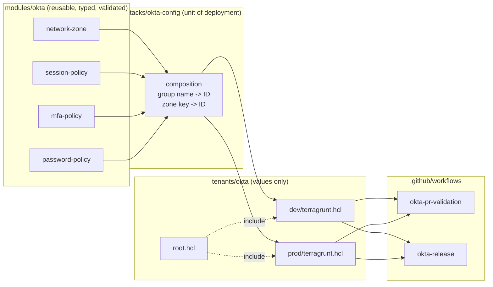
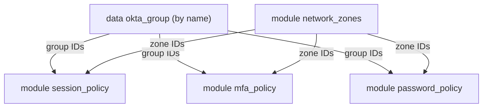
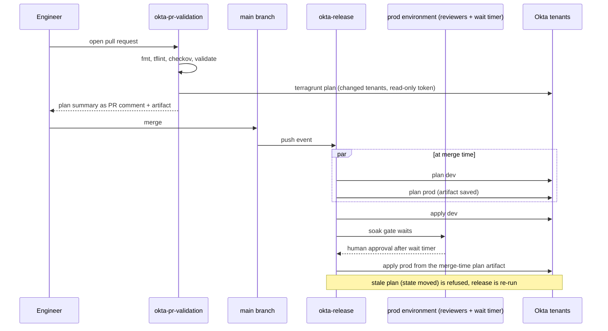

# Architecture

## Layers



Dependencies only point one way. Modules know nothing about stacks. The stack knows
nothing about tenants. Tenants know nothing about pipelines. A change at any layer
is reviewed in the layer where it happens.

## Inside the stack



Zones are created first because every policy rule with a network condition needs a
zone ID. Group IDs are resolved once and shared. Tenants refer to zones by logical key
and to groups by name, so no tenant file ever contains an Okta ID.

## State key scheme

`tenants/okta/root.hcl` derives the key from the tenant's path:

```
key = "okta/${path_relative_to_include()}/terraform.tfstate"
```

| Tenant directory | State key |
|------------------|-----------|
| `tenants/okta/dev` | `okta/dev/terraform.tfstate` |
| `tenants/okta/prod` | `okta/prod/terraform.tfstate` |
| `tenants/okta/sandbox` (future) | `okta/sandbox/terraform.tfstate` |

Bucket, region, and lock table are environment variables (`TG_STATE_BUCKET`,
`TG_STATE_REGION`, `TG_LOCK_TABLE`), never HCL literals. The same repository can be
planned from a laptop and from CI against different state backends with no edits.

## Promotion flow



Two properties matter here:

1. Prod applies the plan file that was produced when the change merged, not a fresh
   plan taken after approval. What the reviewer approved is what runs.
2. Every tenant has its own concurrency group. A PR plan and a release apply for the
   same tenant never overlap, so state locks are never contested by the pipeline
   itself.

## Secrets and identity in CI

| Need | Mechanism | Lifetime |
|------|-----------|----------|
| Read/write state in S3 | GitHub OIDC -> `aws-actions/configure-aws-credentials` -> role from repo variable | Minutes |
| Talk to Okta | GitHub environment secret `OKTA_API_TOKEN` exposed as an env var to the provider | Job |
| Comment on PR | Workflow `GITHUB_TOKEN` with `pull-requests: write` | Job |

No credential is written to disk by the pipeline, and no credential lives in the
repository.
