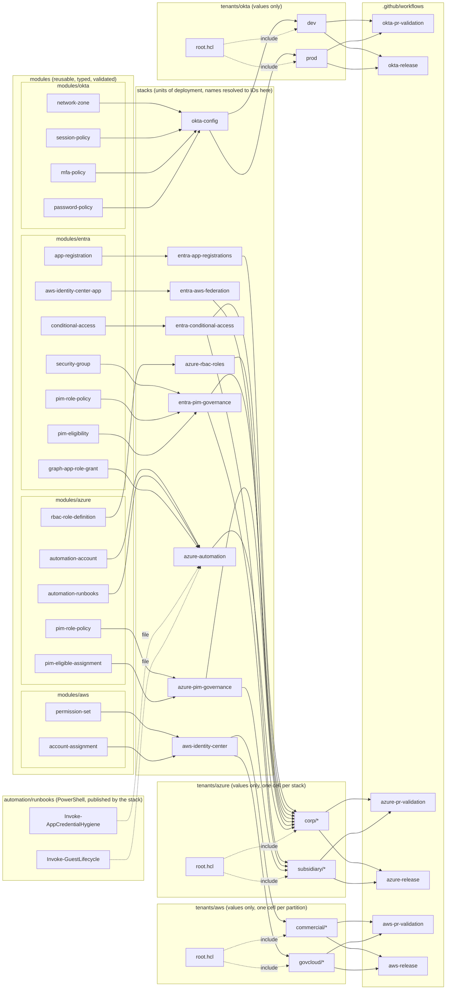
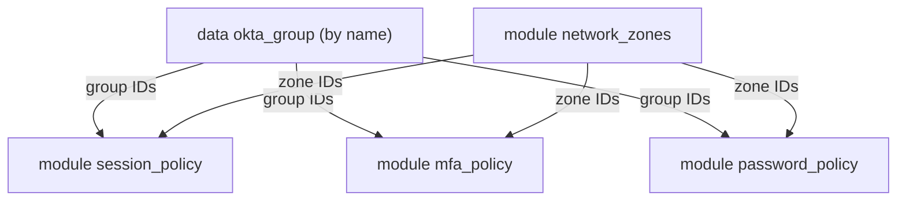
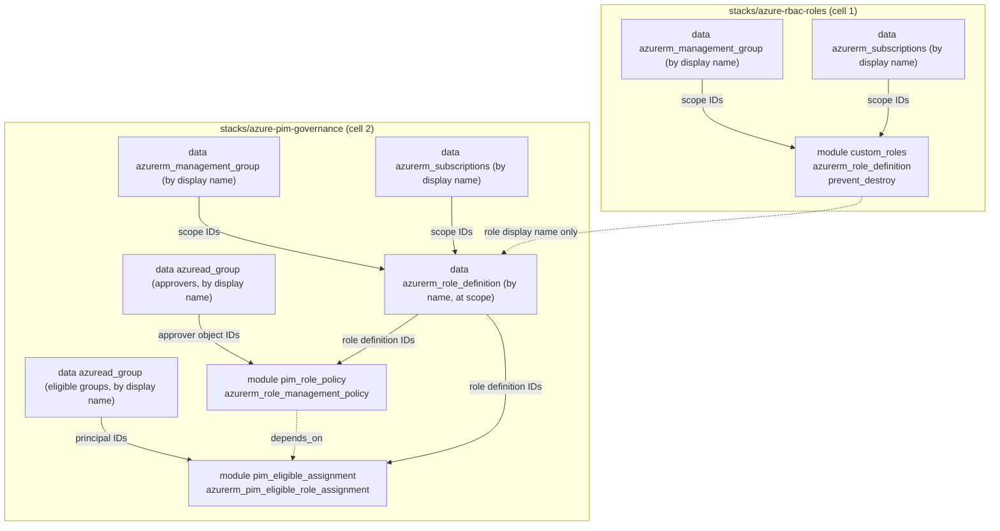
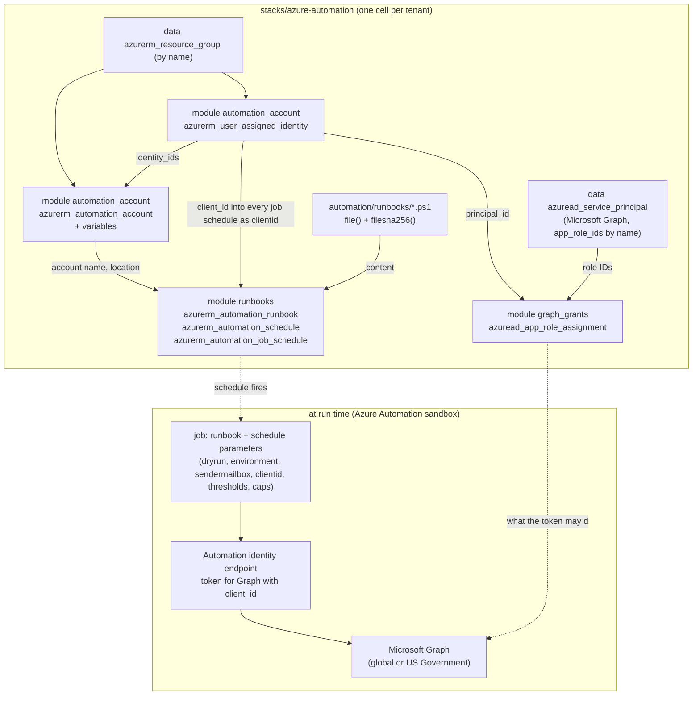
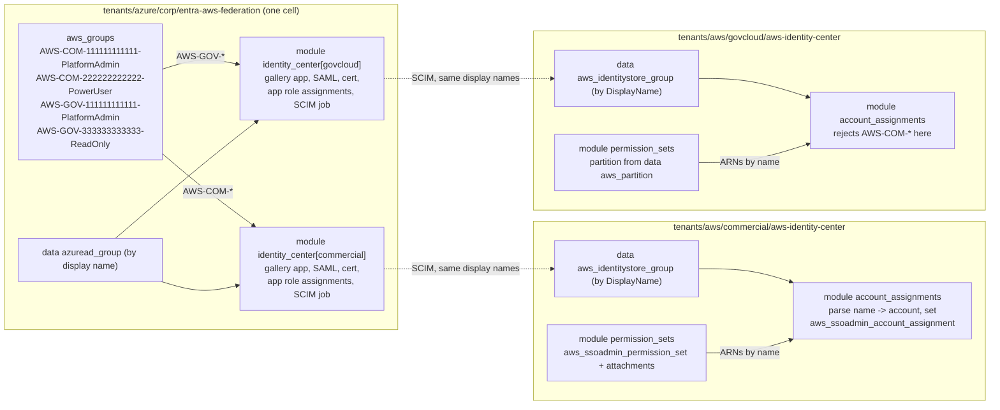
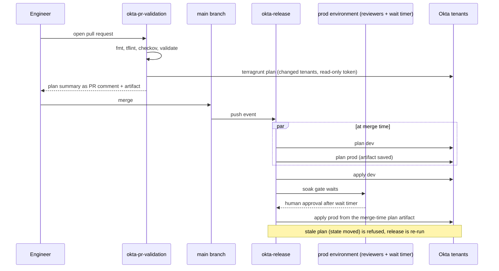

# Architecture

## Layers



Dependencies only point one way. Modules know nothing about stacks. Stacks know
nothing about tenants. Tenants know nothing about pipelines. A change at any layer
is reviewed in the layer where it happens.

Three things are deliberately absent from the diagram. `azure-rbac-roles` has no
edge to `azure-pim-governance`: the governance stack refers to custom roles by
display name and resolves them at plan time, so the coupling is a name, not an
output (ADR 0005). `subsidiary/*` has no `azure-rbac-roles`,
`entra-app-registrations`, `entra-aws-federation`, or `azure-automation` cell,
because the subsidiary assigns built-in roles only, registers no applications,
reaches AWS through corp groups, and has not had the runbooks rolled out. And
`entra-aws-federation` has no edge to `aws-identity-center`
even though one feeds the other: the coupling is the group name
`AWS-<PARTITION>-<accountId>-<PermissionSetName>`, listed in both cells and
resolved on each side at plan time (ADR 0008), not a cross-cloud dependency.

The runbooks are a fourth kind of input. They are not modules (a stack does
not call them) and not tenant values (a cell names a file, never a body); the
`azure-automation` stack reads each file and publishes it, so a runbook edit
is a plan diff like any other.

## Inside the stack



Zones are created first because every policy rule with a network condition needs a
zone ID. Group IDs are resolved once and shared. Tenants refer to zones by logical key
and to groups by name, so no tenant file ever contains an Okta ID.

## Inside the Azure stacks



Policies are written before eligibilities because Azure validates an eligibility's
expiration against the policy at write time, and nothing in the eligibility resource
references the policy resource, so the graph needs an explicit `depends_on`. The
roles cell is applied before the governance cell plans because the role name is
resolved at plan time. Every scope, role, and group is given by name in the tenant
cell, so no cell ever contains a GUID or a management group ID.

## Inside the automation stack



The account and its identity come first because both leaves key off them: the
runbooks module needs the account name and location, and the Graph grants need
the identity's principal ID. The identity's client ID is the one value a cell
cannot know and every runbook needs, so the stack injects it into every job
schedule's parameters along with the cloud, the sender mailbox, and the dry-run
flag; a cell states those once and cannot give two runbooks different answers.
The runbook body is the file in the repository, hashed into a tag so the plan
and the portal both show the deployed revision. What the identity may do is a
list of Graph permission names in the cell (ADR 0010); where a guest is on the
lifecycle ladder is a group membership the runbook resolves by display name
(ADR 0011).

## Across the two clouds: Entra to Identity Center



The Entra cell lists every AWS access group once; the stack hands each
Identity Center application the groups whose partition token matches. Being
assigned to the application is what provisions a group, over SCIM, into that
instance's identity store. The AWS cell for the same instance lists the same
names and parses each into one account assignment. The two cells are in
different trees with different state backends and different credentials, and
nothing passes between them at plan time; the group name is the whole contract,
checked on both sides (ADR 0008). The identity source switch and the SCIM
enablement in the AWS console are manual and one-shot, and the module README
gives the order.

## State key scheme

`tenants/okta/root.hcl` derives the key from the tenant's path:

```
key = "okta/${path_relative_to_include()}/terraform.tfstate"
```

| Tenant directory | State key |
|------------------|-----------|
| `tenants/okta/dev` | `okta/dev/terraform.tfstate` |
| `tenants/okta/prod` | `okta/prod/terraform.tfstate` |
| `tenants/okta/sandbox` (future) | `okta/sandbox/terraform.tfstate` |

Bucket, region, and lock table are environment variables (`TG_STATE_BUCKET`,
`TG_STATE_REGION`, `TG_LOCK_TABLE`), never HCL literals. The same repository can be
planned from a laptop and from CI against different state backends with no edits.

`tenants/azure/root.hcl` does the same against Azure Storage, one level deeper
because each tenant holds one cell per stack:

```
key = "azure/${path_relative_to_include()}/terraform.tfstate"
```

| Cell directory | State key |
|----------------|-----------|
| `tenants/azure/corp/azure-rbac-roles` | `azure/corp/azure-rbac-roles/terraform.tfstate` |
| `tenants/azure/corp/azure-pim-governance` | `azure/corp/azure-pim-governance/terraform.tfstate` |
| `tenants/azure/corp/azure-automation` | `azure/corp/azure-automation/terraform.tfstate` |
| `tenants/azure/corp/entra-conditional-access` | `azure/corp/entra-conditional-access/terraform.tfstate` |
| `tenants/azure/subsidiary/azure-pim-governance` | `azure/subsidiary/azure-pim-governance/terraform.tfstate` |

Resource group, storage account, and container are `TG_AZ_STATE_RG`,
`TG_AZ_STATE_SA`, and `TG_AZ_STATE_CONTAINER`. The backend authenticates with the
Entra token (`use_azuread_auth`), so no storage key exists anywhere in the flow
(ADR 0004). Locking uses blob leases; there is no lock table.

`tenants/aws/root.hcl` is S3 again, with its own variable names because the bucket
is per partition rather than shared with the Okta tree:

```
key = "aws/${path_relative_to_include()}/terraform.tfstate"
```

| Cell directory | State key | Bucket |
|----------------|-----------|--------|
| `tenants/aws/commercial/aws-identity-center` | `aws/commercial/aws-identity-center/terraform.tfstate` | commercial `TG_AWS_STATE_BUCKET` |
| `tenants/aws/govcloud/aws-identity-center` | `aws/govcloud/aws-identity-center/terraform.tfstate` | GovCloud `TG_AWS_STATE_BUCKET` |

`TG_AWS_STATE_BUCKET`, `TG_AWS_STATE_REGION`, and `TG_AWS_LOCK_TABLE` are set per
GitHub environment, because a GovCloud identity cannot reach a commercial bucket
and the reverse. The keys do not collide, so the two could share a bucket if the
partitions ever did (ADR 0009). Locking is DynamoDB because the repository allows
Terraform 1.9, which predates the S3 lock file.

## Promotion flow



Two properties matter here:

1. Prod applies the plan file that was produced when the change merged, not a fresh
   plan taken after approval. What the reviewer approved is what runs.
2. Every tenant has its own concurrency group. A PR plan and a release apply for the
   same tenant never overlap, so state locks are never contested by the pipeline
   itself.

`azure-release` has the same shape with corp in the dev position and subsidiary in
the prod position, and one extra rule: the corp roles cell is applied before the
corp governance cell is planned, because the governance cell resolves custom role
names at plan time. The corp automation cell is planned and applied after the
governance cell, not because anything is resolved from it but so that corp is
completely applied before the gate opens; the gate needs both applies. The
subsidiary plan is still taken at merge time, in parallel, and applied unchanged
after the `subsidiary` environment gate. Concurrency groups are per cell
(`azure-cell-corp-azure-pim-governance`), not per tenant, because two cells of
one tenant have separate state files and can safely run side by side. A change
under `automation/runbooks` triggers the train like a module change, because the
runbook body is what the automation cell publishes.

`aws-release` has the same shape with commercial in the dev position and GovCloud
in the prod position. Each job names its GitHub environment, and the environment
supplies that partition's OIDC role and state bucket, so the two halves of the
train never hold a credential that works in the other partition. The federation
cell on the Azure side is not in any release train yet: the Azure workflows do
not map the SCIM credentials into `TF_VAR_scim_credentials`, and until they do
that cell is applied from a workstation (ADR 0008).

## Secrets and identity in CI

| Need | Mechanism | Lifetime |
|------|-----------|----------|
| Read/write state in S3 | GitHub OIDC -> `aws-actions/configure-aws-credentials` -> role from repo variable | Minutes |
| Talk to Okta | GitHub environment secret `OKTA_API_TOKEN` exposed as an env var to the provider | Job |
| Read/write state in Azure Storage | GitHub OIDC -> `azure/login@v2` -> federated credential on an app or user-assigned identity; backend uses the Entra token (`use_azuread_auth`) | About an hour |
| Talk to Azure Resource Manager and Microsoft Graph | Same federated identity; `ARM_USE_OIDC=true` lets the providers do the token exchange themselves | About an hour |
| Read/write state in S3 and talk to Identity Center, per partition | GitHub OIDC -> `aws-actions/configure-aws-credentials` -> role from the partition's environment variables (`AWS_PLAN_ROLE_ARN`, `AWS_APPLY_ROLE_ARN`) | Minutes |
| Provision users and groups into Identity Center | SCIM endpoint and token issued by the AWS console, held as a GitHub environment secret, passed as the sensitive `TF_VAR_scim_credentials`; stored by the provider in state and in saved plans, rotated from the AWS console | Until rotated |
| Run scheduled identity hygiene against Graph (outside CI) | User-assigned managed identity on the Automation account, created by Terraform; Graph app roles granted by Terraform; each job asks the Automation identity endpoint for a token with the identity's `client_id` | About an hour, per job |
| Comment on PR | Workflow `GITHUB_TOKEN` with `pull-requests: write` | Job |

The Azure identity is split by purpose and tenant. `AZ_CLIENT_ID`, `AZ_TENANT_ID`,
and `AZ_SUBSCRIPTION_ID` are repository variables that each GitHub environment
overrides: `corp-plan` and `subsidiary-plan` point at reader identities, `corp` and
`subsidiary-apply` at writers. No client secret exists for any of them.

The AWS identity is split by purpose and partition the same way. `AWS_PLAN_ROLE_ARN`
and `AWS_APPLY_ROLE_ARN` are repository variables that each GitHub environment
overrides: `commercial-plan` and `govcloud-plan` point at reader roles, `commercial`
and `govcloud-apply` at writers, and the GovCloud ones are `arn:aws-us-gov` roles in
the GovCloud delegated administrator account.

No credential is written to disk by the pipeline, and no credential lives in the
repository.
