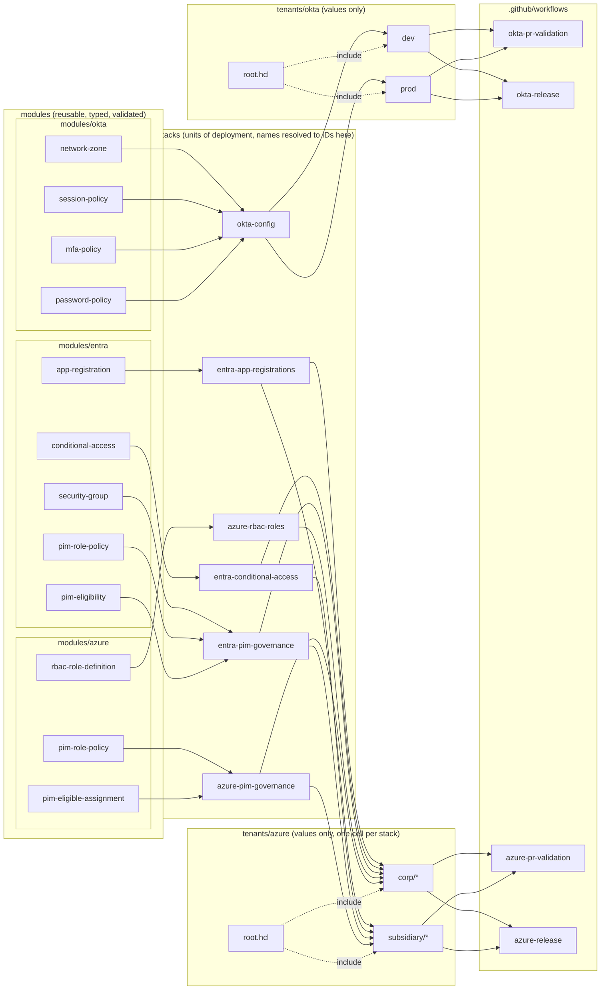
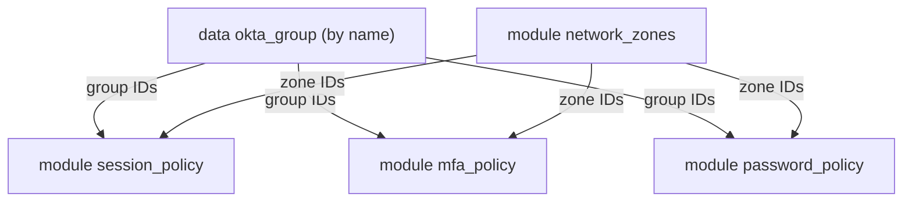
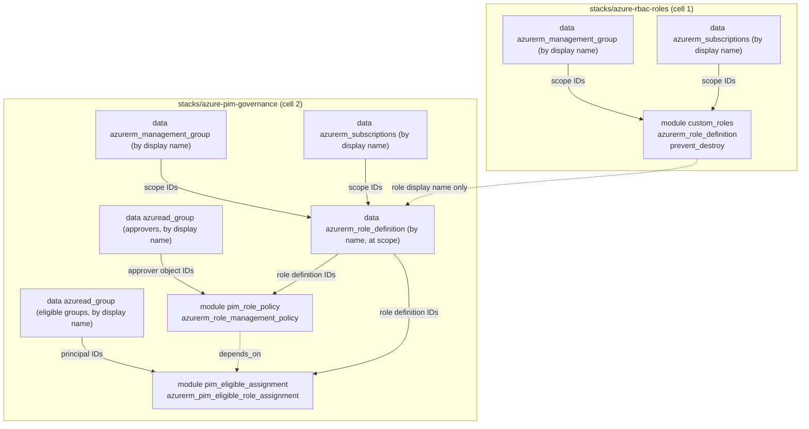
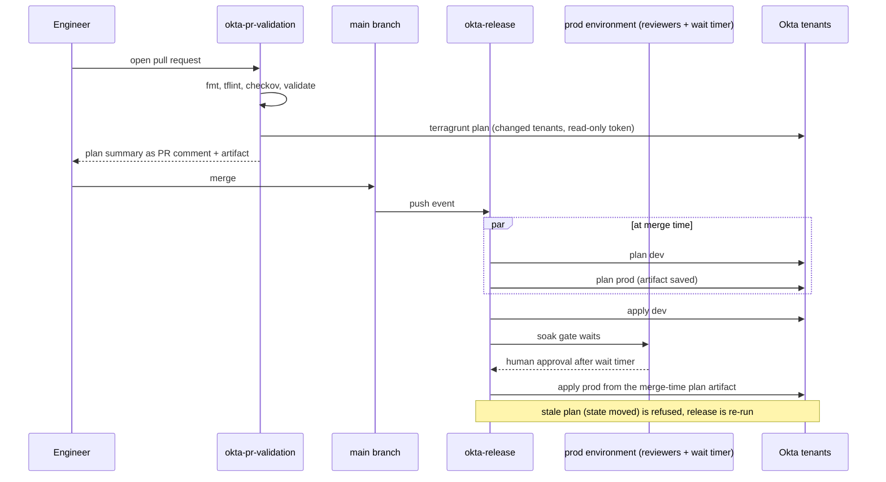

# Architecture

## Layers



Dependencies only point one way. Modules know nothing about stacks. Stacks know
nothing about tenants. Tenants know nothing about pipelines. A change at any layer
is reviewed in the layer where it happens.

Two things are deliberately absent from the diagram. `azure-rbac-roles` has no
edge to `azure-pim-governance`: the governance stack refers to custom roles by
display name and resolves them at plan time, so the coupling is a name, not an
output (ADR 0005). And `subsidiary/*` has no `azure-rbac-roles` cell, because the
subsidiary assigns built-in roles only.

## Inside the stack



Zones are created first because every policy rule with a network condition needs a
zone ID. Group IDs are resolved once and shared. Tenants refer to zones by logical key
and to groups by name, so no tenant file ever contains an Okta ID.

## Inside the Azure stacks



Policies are written before eligibilities because Azure validates an eligibility's
expiration against the policy at write time, and nothing in the eligibility resource
references the policy resource, so the graph needs an explicit `depends_on`. The
roles cell is applied before the governance cell plans because the role name is
resolved at plan time. Every scope, role, and group is given by name in the tenant
cell, so no cell ever contains a GUID or a management group ID.

## State key scheme

`tenants/okta/root.hcl` derives the key from the tenant's path:

```
key = "okta/${path_relative_to_include()}/terraform.tfstate"
```

| Tenant directory | State key |
|------------------|-----------|
| `tenants/okta/dev` | `okta/dev/terraform.tfstate` |
| `tenants/okta/prod` | `okta/prod/terraform.tfstate` |
| `tenants/okta/sandbox` (future) | `okta/sandbox/terraform.tfstate` |

Bucket, region, and lock table are environment variables (`TG_STATE_BUCKET`,
`TG_STATE_REGION`, `TG_LOCK_TABLE`), never HCL literals. The same repository can be
planned from a laptop and from CI against different state backends with no edits.

`tenants/azure/root.hcl` does the same against Azure Storage, one level deeper
because each tenant holds one cell per stack:

```
key = "azure/${path_relative_to_include()}/terraform.tfstate"
```

| Cell directory | State key |
|----------------|-----------|
| `tenants/azure/corp/azure-rbac-roles` | `azure/corp/azure-rbac-roles/terraform.tfstate` |
| `tenants/azure/corp/azure-pim-governance` | `azure/corp/azure-pim-governance/terraform.tfstate` |
| `tenants/azure/corp/entra-conditional-access` | `azure/corp/entra-conditional-access/terraform.tfstate` |
| `tenants/azure/subsidiary/azure-pim-governance` | `azure/subsidiary/azure-pim-governance/terraform.tfstate` |

Resource group, storage account, and container are `TG_AZ_STATE_RG`,
`TG_AZ_STATE_SA`, and `TG_AZ_STATE_CONTAINER`. The backend authenticates with the
Entra token (`use_azuread_auth`), so no storage key exists anywhere in the flow
(ADR 0004). Locking uses blob leases; there is no lock table.

## Promotion flow



Two properties matter here:

1. Prod applies the plan file that was produced when the change merged, not a fresh
   plan taken after approval. What the reviewer approved is what runs.
2. Every tenant has its own concurrency group. A PR plan and a release apply for the
   same tenant never overlap, so state locks are never contested by the pipeline
   itself.

`azure-release` has the same shape with corp in the dev position and subsidiary in
the prod position, and one extra rule: the corp roles cell is applied before the
corp governance cell is planned, because the governance cell resolves custom role
names at plan time. The subsidiary plan is still taken at merge time, in parallel,
and applied unchanged after the `subsidiary` environment gate. Concurrency groups
are per cell (`azure-cell-corp-azure-pim-governance`), not per tenant, because two
cells of one tenant have separate state files and can safely run side by side.

## Secrets and identity in CI

| Need | Mechanism | Lifetime |
|------|-----------|----------|
| Read/write state in S3 | GitHub OIDC -> `aws-actions/configure-aws-credentials` -> role from repo variable | Minutes |
| Talk to Okta | GitHub environment secret `OKTA_API_TOKEN` exposed as an env var to the provider | Job |
| Read/write state in Azure Storage | GitHub OIDC -> `azure/login@v2` -> federated credential on an app or user-assigned identity; backend uses the Entra token (`use_azuread_auth`) | About an hour |
| Talk to Azure Resource Manager and Microsoft Graph | Same federated identity; `ARM_USE_OIDC=true` lets the providers do the token exchange themselves | About an hour |
| Comment on PR | Workflow `GITHUB_TOKEN` with `pull-requests: write` | Job |

The Azure identity is split by purpose and tenant. `AZ_CLIENT_ID`, `AZ_TENANT_ID`,
and `AZ_SUBSCRIPTION_ID` are repository variables that each GitHub environment
overrides: `corp-plan` and `subsidiary-plan` point at reader identities, `corp` and
`subsidiary-apply` at writers. No client secret exists for any of them.

No credential is written to disk by the pipeline, and no credential lives in the
repository.
