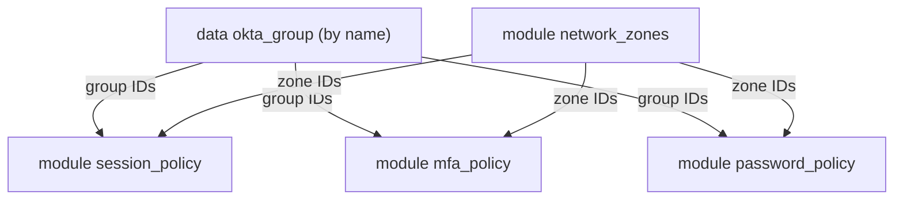
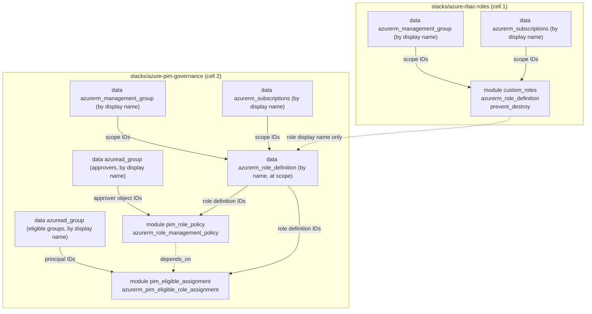
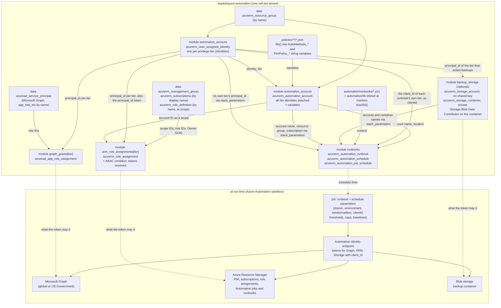
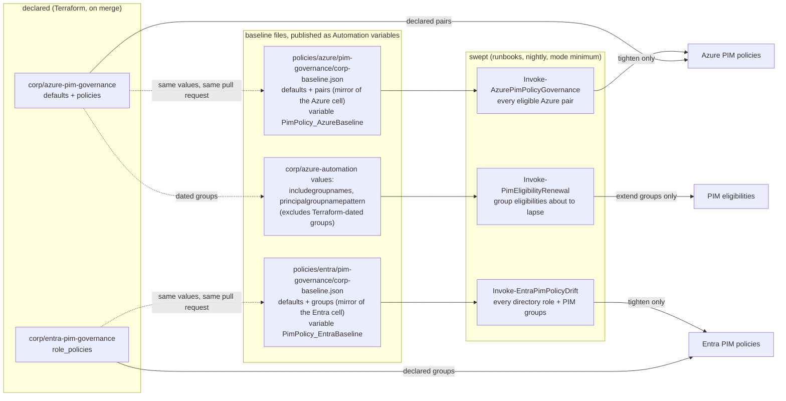
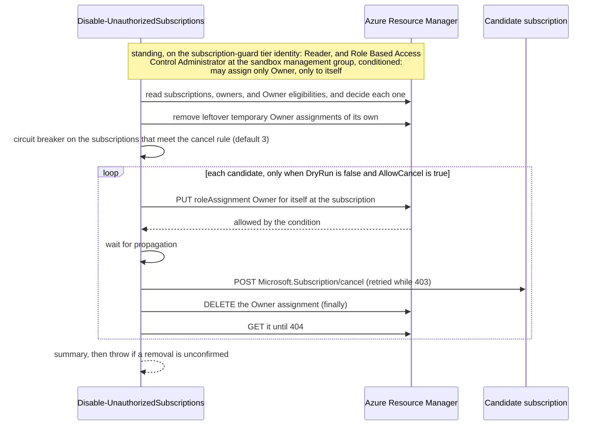
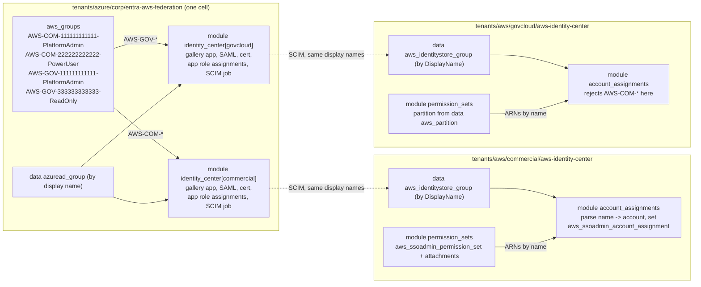
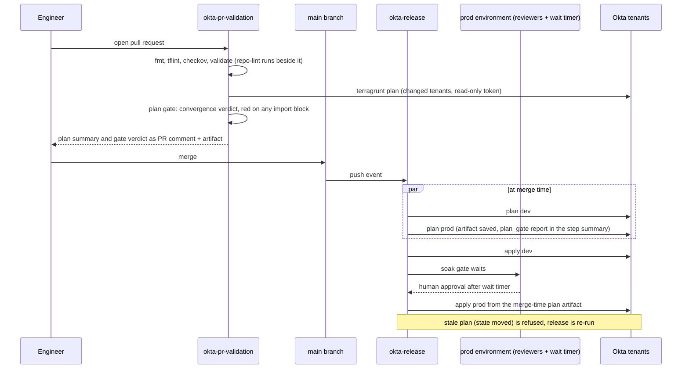

# Architecture

## Layers

```mermaid
flowchart LR
  subgraph modules["modules (reusable, typed, validated)"]
    subgraph mokta["modules/okta"]
      NZ[network-zone]
      SP[session-policy]
      MP[mfa-policy]
      PP[password-policy]
    end
    subgraph mentra["modules/entra"]
      EAR[app-registration]
      ECA[conditional-access]
      ESG[security-group]
      EPP[pim-role-policy]
      EPE[pim-eligibility]
      EAI[aws-identity-center-app]
      EGG[graph-app-role-grant]
    end
    subgraph mazure["modules/azure"]
      ARD[rbac-role-definition]
      APP[pim-role-policy]
      APE[pim-eligible-assignment]
      AAC[automation-account]
      ARB[automation-runbooks]
      AWR[workload-role-assignment]
      ABS[backup-storage]
      ARG[resource-group]
      AMI[managed-identity]
      AKV[key-vault]
      AST[storage-account]
      ASB[subscription-baseline]
    end
    subgraph maws["modules/aws"]
      WPS[permission-set]
      WAA[account-assignment]
      WSR[iam-service-role]
      WKK[kms-key]
      WS3[s3-bucket]
      WAH[account-hardening]
      WCT[cloudtrail]
      WLG[log-group]
      WPN[ssm-parameter-namespace]
    end
  end

  subgraph stacks["stacks (units of deployment, names resolved to IDs here)"]
    SO[okta-config]
    SEA[entra-app-registrations]
    SEC[entra-conditional-access]
    SEP[entra-pim-governance]
    SEF[entra-aws-federation]
    SAR[azure-rbac-roles]
    SAP[azure-pim-governance]
    SAA[azure-automation]
    SWI[aws-identity-center]
    SAB[aws-account-baseline]
    SAW[aws-account-workloads]
    SPA["apps/aws/payments-api"]
    SSB[azure-subscription-baseline]
    SSW[azure-subscription-workloads]
    SDP["apps/azure/data-pipeline"]
  end

  subgraph runbooks["automation/runbooks (PowerShell, published by the stack)"]
    RB1[Invoke-AppCredentialHygiene]
    RB2[Invoke-GuestLifecycle]
    RB3[Invoke-AuthenticationMethodsDrift]
    LIB[automation/lib/AuthenticationMethods.Common]
    RB4[Backup-AutomationRunbooks]
    RB5[Invoke-PimEligibilityRenewal]
    RB6[Disable-UnauthorizedSubscriptions]
    RB7[Invoke-AzurePimPolicyGovernance]
    RB8[Invoke-EntraPimPolicyDrift]
    RB9[Watch-AutomationJobFailures]
    RCL[automation/lib/Runbook.Common]
  end

  subgraph desired["policies (desired-state JSON, no Terraform resource, or no safe job parameter)"]
    AMP[entra/authentication-methods]
    AMS[scripts/Set-AuthenticationMethods]
    PBA[azure/pim-governance/corp-baseline.json]
    PBE[entra/pim-governance/corp-baseline.json]
  end

  subgraph tokta["tenants/okta (values only)"]
    RO[root.hcl]
    DEV[dev]
    PROD[prod]
  end

  subgraph tazure["tenants/azure (values only, one cell per stack; one per subscription under subscriptions/)"]
    RA[root.hcl]
    CORP[corp/*]
    SUB[subsidiary/*]
    SLOC["corp/subscriptions/sub-example-prod/subscription.hcl\n(locator, not a cell)"]
    CSUB["corp/subscriptions/sub-example-prod/*"]
  end

  subgraph taws["tenants/aws (values only, one cell per partition; one per account under accounts/)"]
    RW[root.hcl]
    PLOC["commercial/partition.hcl\ngovcloud/partition.hcl\n(locators, not cells)"]
    COMM[commercial/*]
    GOVC[govcloud/*]
    ALOC["commercial/accounts/example-prod/account.hcl\ncommercial/accounts/example-dev/account.hcl\n(locators, not cells)"]
    ACCT["commercial/accounts/*/*"]
  end

  subgraph tools["tools (Python, standard library; runs on a runner or a workstation, never in a tenant)"]
    PGT[plan_gate]
    RLT["repo_lint\ncells"]
  end

  subgraph pipelines[".github/workflows"]
    OPR[okta-pr-validation]
    OREL[okta-release]
    APR[azure-pr-validation]
    AREL[azure-release]
    WPR[aws-pr-validation]
    WREL[aws-release]
    RL[repo-lint]
  end

  NZ --> SO
  SP --> SO
  MP --> SO
  PP --> SO
  EAR --> SEA
  ECA --> SEC
  ESG --> SEP
  EPP --> SEP
  EPE --> SEP
  EAI --> SEF
  ARD --> SAR
  APP --> SAP
  APE --> SAP
  AAC --> SAA
  ARB --> SAA
  EGG --> SAA
  AWR --> SAA
  ABS --> SAA
  RB1 -.file.-> SAA
  RB2 -.file.-> SAA
  RB3 -.file.-> SAA
  LIB -.inlined into RB3.-> SAA
  RB4 -.file.-> SAA
  RB5 -.file.-> SAA
  RB6 -.file.-> SAA
  RB7 -.file.-> SAA
  RB8 -.file.-> SAA
  RB9 -.file.-> SAA
  RCL -.inlined into RB4 to RB9.-> SAA
  LIB -.dot-sourced.-> AMS
  AMP -.variables.-> SAA
  AMP -.folder.-> AMS
  PBA -.variable PimPolicy_AzureBaseline.-> SAA
  PBE -.variable PimPolicy_EntraBaseline.-> SAA
  WPS --> SWI
  WAA --> SWI
  WSR --> SAW
  WKK --> SAW
  WS3 --> SAW
  WSR --> SPA
  WKK --> SPA
  WS3 --> SPA
  WLG --> SPA
  WPN --> SPA
  WAH --> SAB
  WKK --> SAB
  WS3 --> SAB
  WCT --> SAB
  ARG --> SSB
  ASB --> SSB
  ARG --> SSW
  AMI --> SSW
  AKV --> SSW
  AST --> SSW
  ARG --> SDP
  AMI --> SDP
  AKV --> SDP
  AST --> SDP
  AWR --> SDP

  SO --> DEV
  SO --> PROD
  SEA --> CORP
  SEC --> CORP
  SEP --> CORP
  SEF --> CORP
  SAR --> CORP
  SAP --> CORP
  SAA --> CORP
  SEC --> SUB
  SEP --> SUB
  SAP --> SUB
  SWI --> COMM
  SWI --> GOVC
  SAB --> ACCT
  SAW --> ACCT
  SPA --> ACCT
  SSB --> CSUB
  SSW --> CSUB
  SDP --> CSUB

  RO -.include.-> DEV
  RO -.include.-> PROD
  RA -.include.-> CORP
  RA -.include.-> SUB
  RW -.include.-> COMM
  RW -.include.-> GOVC
  RA -.include.-> CSUB
  RW -.include.-> ACCT
  SLOC -.read by root.hcl for subscription_id.-> CSUB
  PLOC -.read by root.hcl for region and partition.-> COMM
  PLOC -.read by root.hcl for region and partition.-> GOVC
  PLOC -.read by root.hcl for region and partition.-> ACCT
  ALOC -.read by root.hcl for allowed_account_ids and the account profile.-> ACCT

  DEV --> OPR
  PROD --> OPR
  DEV --> OREL
  PROD --> OREL
  CORP --> APR
  SUB --> APR
  CORP --> AREL
  SUB --> AREL
  AMS -.PATCH job.-> AREL
  AMS -.drift check.-> APR
  COMM --> WPR
  GOVC --> WPR
  COMM --> WREL
  GOVC --> WREL
  CSUB --> APR
  CSUB --> AREL
  ACCT --> WPR
  ACCT --> WREL

  PGT -.plan gate.-> OPR
  PGT -.plan gate.-> APR
  PGT -.plan gate.-> WPR
  PGT -.report.-> OREL
  PGT -.report.-> AREL
  PGT -.report.-> WREL
  RLT -.cells.py waves.-> WREL
  RLT --> RL
```

Dependencies only point one way. Modules know nothing about stacks. Stacks know
nothing about tenants. Tenants know nothing about pipelines. A change at any layer
is reviewed in the layer where it happens.

Four things are deliberately absent from the diagram. `azure-rbac-roles` has no
edge to `azure-pim-governance` or `azure-automation`: both refer to custom roles
by display name and resolve them at plan time, so the coupling is a name, not an
output (ADR 0005). Nor do the PIM stacks have an edge to the PIM runbooks: the
baseline files under `policies/` mirror their declared entries, and a pull
request that changes one changes the other (ADR 0015). `subsidiary/*` has no `azure-rbac-roles`,
`entra-app-registrations`, `entra-aws-federation`, or `azure-automation` cell,
because the subsidiary assigns built-in roles only, registers no applications,
reaches AWS through corp groups, and has not had the runbooks rolled out. And
`entra-aws-federation` has no edge to `aws-identity-center`
even though one feeds the other: the coupling is the group name
`AWS-<PARTITION>-<accountId>-<PermissionSetName>`, listed in both cells and
resolved on each side at plan time (ADR 0008), not a cross-cloud dependency.

The runbooks are a fourth kind of input. They are not modules (a stack does
not call them) and not tenant values (a cell names a file, never a body); the
`azure-automation` stack reads each file and publishes it, so a runbook edit
is a plan diff like any other. Seven runbooks are assembled rather than read:
each names a library under `automation/lib` and the runbooks module inlines it
between two marker lines at plan time. The authentication methods drift
runbook names `AuthenticationMethods.Common`, so the diff logic exists once
and is also dot-sourced by the workstation script; the six newer runbooks
name `Runbook.Common`, so their logging, identity, transport, lookups,
breaker, and summary exist once and a change to them is a plan diff on all
six (ADR 0013).

The desired-state files under `policies/` are a fifth kind: objects no
Terraform resource holds, and configuration a job schedule cannot carry
safely. `entra/authentication-methods` is the first. The stack publishes each
file as an Automation variable (so the runbook reads what the repository
says), and the pipelines run `scripts/Set-AuthenticationMethods.ps1` against
the folder directly: read-only with `-FailOnDrift` on a pull request, and
`-DryRun:$false` in the release train after the corp governance cell (ADR
0012). The two PIM baselines, `azure/pim-governance/corp-baseline.json` and
`entra/pim-governance/corp-baseline.json`, travel the same way, because a job
schedule binds only `[bool]`, `[int]`, and `[string]` reliably and the
Automation service may parse JSON-looking parameter text before it binds it:
the schedule carries the variable's name and the runbook reads the variable
(ADR 0015). Nothing under `policies/` is state; the live tenant is compared
with the files every time.

The locator files are a sixth kind, and the only one the cells never see.
`partition.hcl`, `account.hcl`, and `subscription.hcl` are not cells (no
include, no source, no inputs; Terragrunt never runs them) and not values (no
cell reads them); they are addressing. Each `root.hcl` finds the locators
above the cell it is planning with `find_in_parent_folders` and turns them
into provider configuration: the AWS root generates `allowed_account_ids`
and `profile = "identity-as-code-<account name>"`, and supplies `region`;
the deployment role `arn:<partition>:iam::<account id>:role/<TG_AWS_DEPLOY_ROLE_NAME>`
is named in that profile on the runner, never in the generated file,
because a saved plan carries the file and the plan and apply environments
name different roles. The Azure root puts the locator's `subscription_id`
into the `azurerm` provider in place of `ARM_SUBSCRIPTION_ID`. A malformed
locator, or one whose name does not match its directory, fails
`terragrunt init`. The cells under `accounts/` and `subscriptions/` are the
same three blocks as every other cell, and the stacks they point at come in
three kinds: the shared platform stacks, the catalogs
(`aws-account-workloads`, `azure-subscription-workloads`) that offer vetted
shapes as values, and the app stacks under `stacks/apps` that hold one
application's composition (ADR 0017). The diagram shows `sub-example-prod`
and the two commercial accounts; a new account or subscription is a directory
with a locator, and the pull request workflows find cells by the presence of
`terragrunt.hcl`, not by depth. A new AWS cell needs no workflow edit,
because `aws-release` reads its cells and their waves from
`tools/repo_lint/cells.py`; a new Azure cell still needs its plan and apply
jobs added to `azure-release`, which lists cells explicitly (ADR 0018 says
why that train is the follow-up).

The tools under `tools/` are the one layer that is not an input to a plan.
They read the repository and a plan's JSON, on a runner or a workstation,
and never a tenant: `plan_gate` holds a plan to a profile after every pull
request plan and reports the merge-time plan at each gate; `repo_lint`
checks the tree against the sentences this document and the README state;
`cells` finds the cells, selects the ones a change touches, and orders them
into the waves the AWS release train runs. They are Python with no
dependency outside the standard library, and the runbooks stay PowerShell
because Azure Automation runs them (ADR 0018).

## Inside the stack



Zones are created first because every policy rule with a network condition needs a
zone ID. Group IDs are resolved once and shared. Tenants refer to zones by logical key
and to groups by name, so no tenant file ever contains an Okta ID.

## Inside the Azure stacks



Policies are written before eligibilities because Azure validates an eligibility's
expiration against the policy at write time, and nothing in the eligibility resource
references the policy resource, so the graph needs an explicit `depends_on`. The
roles cell is applied before the governance cell plans because the role name is
resolved at plan time. Every scope, role, and group is given by name in the tenant
cell, so no cell ever contains a GUID or a management group ID.

## Inside the automation stack



The account and its identities come first because both leaves key off them:
the runbooks module needs the account name and location, and the Graph grants
need each identity's principal ID. There is one user-assigned identity per
privilege tier, all attached to the one account, and every runbook names the
tier it runs as; the stack passes that tier's client ID as the runbook's
`clientid`, along with the cloud, the sender mailbox, and the dry-run flag,
which a cell states once and cannot give two runbooks different answers to. A
tier holds only what its own runbooks use, so a defect in the backup runbook
no longer runs as an identity that can rewrite Global Administrator's PIM
policy; what it does not do is stop anyone who can publish a runbook in the
account from asking for another tier's token, and ADR 0016 says when that
calls for separate accounts. The runbook body is the file in the repository,
hashed into a tag so the plan and the portal both show the deployed revision.
Where a guest is on the lifecycle ladder is a group membership the runbook
resolves by display name (ADR 0011). The authentication methods desired state
and the two PIM baselines reach their runbooks the same way the client ID
does, through the account: one string variable per JSON file, published from
the repository, so a comparison is against the merged files and never against
a portal-edited copy, and so no runbook has to take JSON in a job schedule
parameter (ADR 0012, ADR 0015).

Three more values follow the client ID's pattern. A runbook entry can ask for
the account's own name, resource group, and subscription, its own identity's
principal ID, and the backup storage names through `stack_parameters`, by
naming the value, so the job watcher and the backup watch and copy the account
they run in and the subscription guard can check its own token against the
identity Terraform created, all without a cell typing an ID. Asking for a
backup value is also what gives that tier the container role, so the writer is
derived from the runbook that writes. What a tier may do in Azure Resource
Manager is its own `arm_role_assignments`: scope names and role names,
resolved at plan time like every other Azure stack, and for the subscription
guard an ABAC delegation condition whose `<principal_id>` and
`<role_id:Owner>` tokens the module replaces with that identity's object ID
and the Owner role's GUID (ADR 0014). The backup storage is optional and
keyless: shared key access is off, the container is private, versioning and
soft delete are on with a lifecycle rule behind them, and the data role is
scoped to the container alone. The job watcher's state variable is the one
account object no module declares, because the watcher owns it.

## Two writers for PIM settings



Terraform owns what a cell declares; the runbooks sweep everything else every
night. The built-in baselines are the stacks' defaults, the baseline file
mirrors every declared entry, and both sweeps treat the baseline as a floor,
so on a declared pair the two writers agree by construction and a plan after
a sweep shows nothing the sweep changed. A stale mirror shows up as a nightly
digest and a plan diff, not as silence. The renewal leaves the dates
Terraform declared to Terraform (ADR 0015).

## Just-in-time elevation for the subscription guard



The order matters and matches the code: every subscription is decided first,
because the leftover sweep asks only the scopes that pass did not already
read; then the leftovers of an interrupted job are removed, which is the one
write allowed before the breaker because it only takes this identity's own
access away; then the breaker counts the subscriptions that meet the cancel
rule.

The condition limits what the identity may assign (Owner) and to whom
(itself), not where under that management group, so the identity is
Owner-equivalent over the management group it is assigned at. The assignment
goes at the narrowest management group that holds only the targeted
subscriptions, and never above production. What the condition buys is that a
decision bug can at worst cancel a subscription there, and cannot grant a
person or another workload anything; it is not a boundary against someone who
can publish a runbook in the account, who can have that identity assign itself
Owner at the management group (ADR 0014, ADR 0016).

Nothing is canceled until two switches are turned, in this order: `dry_run =
false`, which makes a report-only live run that mails the digest, and then
`allowcancel = "true"`, after the Cancel decision is signed off and a sandbox
round trip has proved the offer can be canceled and reactivated. With
`AllowCancel` false no Owner assignment is created at all.

## Across the two clouds: Entra to Identity Center



The Entra cell lists every AWS access group once; the stack hands each
Identity Center application the groups whose partition token matches. Being
assigned to the application is what provisions a group, over SCIM, into that
instance's identity store. The AWS cell for the same instance lists the same
names and parses each into one account assignment. The two cells are in
different trees with different state backends and different credentials, and
nothing passes between them at plan time; the group name is the whole contract,
checked on both sides (ADR 0008). The identity source switch and the SCIM
enablement in the AWS console are manual and one-shot, and the module README
gives the order.

## State key scheme

`tenants/okta/root.hcl` derives the key from the tenant's path:

```
key = "okta/${path_relative_to_include()}/terraform.tfstate"
```

| Tenant directory | State key |
|------------------|-----------|
| `tenants/okta/dev` | `okta/dev/terraform.tfstate` |
| `tenants/okta/prod` | `okta/prod/terraform.tfstate` |
| `tenants/okta/sandbox` (future) | `okta/sandbox/terraform.tfstate` |

Bucket, region, and lock table are environment variables (`TG_STATE_BUCKET`,
`TG_STATE_REGION`, `TG_LOCK_TABLE`), never HCL literals. The same repository can be
planned from a laptop and from CI against different state backends with no edits.

`tenants/azure/root.hcl` does the same against Azure Storage, one level deeper
because each tenant holds one cell per stack:

```
key = "azure/${path_relative_to_include()}/terraform.tfstate"
```

| Cell directory | State key |
|----------------|-----------|
| `tenants/azure/corp/azure-rbac-roles` | `azure/corp/azure-rbac-roles/terraform.tfstate` |
| `tenants/azure/corp/azure-pim-governance` | `azure/corp/azure-pim-governance/terraform.tfstate` |
| `tenants/azure/corp/azure-automation` | `azure/corp/azure-automation/terraform.tfstate` |
| `tenants/azure/corp/entra-conditional-access` | `azure/corp/entra-conditional-access/terraform.tfstate` |
| `tenants/azure/subsidiary/azure-pim-governance` | `azure/subsidiary/azure-pim-governance/terraform.tfstate` |
| `tenants/azure/corp/subscriptions/sub-example-prod/azure-subscription-baseline` | `azure/corp/subscriptions/sub-example-prod/azure-subscription-baseline/terraform.tfstate` |
| `tenants/azure/corp/subscriptions/sub-example-prod/data-pipeline` | `azure/corp/subscriptions/sub-example-prod/data-pipeline/terraform.tfstate` |

The `subscription.hcl` locator beside a subscription cell plays no part in
the key: the key is the path, and the locator only addresses the provider.

Resource group, storage account, and container are `TG_AZ_STATE_RG`,
`TG_AZ_STATE_SA`, and `TG_AZ_STATE_CONTAINER`. The backend authenticates with the
Entra token (`use_azuread_auth`), so no storage key exists anywhere in the flow
(ADR 0004). Locking uses blob leases; there is no lock table.

`tenants/aws/root.hcl` is S3 again, with its own variable names because the bucket
is per partition rather than shared with the Okta tree:

```
key = "aws/${path_relative_to_include()}/terraform.tfstate"
```

| Cell directory | State key | Bucket |
|----------------|-----------|--------|
| `tenants/aws/commercial/aws-identity-center` | `aws/commercial/aws-identity-center/terraform.tfstate` | commercial `TG_AWS_STATE_BUCKET` |
| `tenants/aws/govcloud/aws-identity-center` | `aws/govcloud/aws-identity-center/terraform.tfstate` | GovCloud `TG_AWS_STATE_BUCKET` |
| `tenants/aws/commercial/accounts/example-prod/aws-account-baseline` | `aws/commercial/accounts/example-prod/aws-account-baseline/terraform.tfstate` | commercial `TG_AWS_STATE_BUCKET` |
| `tenants/aws/commercial/accounts/example-prod/payments-api` | `aws/commercial/accounts/example-prod/payments-api/terraform.tfstate` | commercial `TG_AWS_STATE_BUCKET` |

`partition.hcl` and `account.hcl` play no part in the key either; an account
cell's state sits under the account's directory because the path does.

`TG_AWS_STATE_BUCKET`, `TG_AWS_STATE_REGION`, and `TG_AWS_LOCK_TABLE` are set per
GitHub environment, because a GovCloud identity cannot reach a commercial bucket
and the reverse. The keys do not collide, so the two could share a bucket if the
partitions ever did (ADR 0009). Locking is DynamoDB because the repository allows
Terraform 1.9, which predates the S3 lock file.

## Promotion flow



Two properties matter here:

1. Prod applies the plan file that was produced when the change merged, not a fresh
   plan taken after approval. What the reviewer approved is what runs.
2. Every tenant has its own concurrency group. A PR plan and a release apply for the
   same tenant never overlap, so state locks are never contested by the pipeline
   itself.

`azure-release` has the same shape with corp in the dev position and subsidiary in
the prod position, and one extra rule: the corp roles cell is applied before the
corp governance cell is planned, because the governance cell resolves custom role
names at plan time. The corp automation cell resolves custom roles the
same way, for its tier identities' role assignments, and is planned and applied
after the governance cell, which also puts it after the roles cell and makes
corp completely applied before the gate opens; the gate needs both applies.

That ordering has a cost on the pull request that introduces a role. A custom
role is resolved by name at plan time, and a role that does not exist yet
cannot be resolved, so a pull request that adds a role definition **and** its
first use plans red in the consuming cell ("Role definition ... was not
found") until the roles cell has been applied on merge. The plan is correct
and the release order fixes it, but a red plan that has to be explained in the
pull request is not a good review signal. The practice is to land role
definitions in their own pull request first, let the release train apply the
roles cell, and put the assignment in the next one; where that is not
practical, say in the description which plan is expected to fail and why.

The subsidiary plan is still taken at merge time, in parallel, and applied
unchanged after the `subsidiary` environment gate. Concurrency groups are per
cell (`azure-cell-corp-azure-pim-governance`), not per tenant, because two
cells of one tenant have separate state files and can safely run side by side.
A change under `automation/runbooks`, `automation/lib`, or `policies/` (the
authentication methods folder and the two PIM baselines) triggers the train
like a module change, because the runbook body, the inlined library, and the
desired-state variables are what the automation cell publishes. The train has
one job that is not a Terraform apply: `apply-corp-auth-methods` runs
`scripts/Set-AuthenticationMethods.ps1 -DryRun:$false` with a Graph token from
the same OIDC login, after `apply-corp-pim` (the policy names a group that
cell creates) and before the subsidiary gate. The pull request workflow runs
the same script read-only with `-FailOnDrift` when that folder, the script,
`automation/lib/AuthenticationMethods.Common.ps1`, or the drift runbook
changes, so the reviewer sees the field-level report before anything is
patched, and an edit to the other library does not drag an unrelated tenant
check into the pull request (ADR 0012).

A third Azure workflow is not a release at all: `automation-tests` runs the
Pester suite on `windows-latest` under Windows PowerShell 5.1 and PowerShell 7
with Pester 4.10.1 for every pull request and push that touches `automation/`,
`scripts/`, `policies/`, or `tenants/`. The last two are in the trigger because
the suite asserts against them as well as against the code: the baseline tests
read `policies/azure/pim-governance` and `policies/entra/pim-governance` and the
corp cells, so a change to a baseline or a cell alone still runs the checks that
guard it. It needs no credential and holds `contents: read` only, because
every HTTP call in those tests is mocked.

A fourth workflow belongs to no family: `repo-lint` runs the two tool test
suites under pytest, then `tools/repo_lint/repo_lint.py` over the whole tree
and `tools/repo_lint/cells.py` over every cell, on every pull request and
push to `main`, with `contents: read` and nothing installed but pytest and
the optional `python-hcl2` cross-check (ADR 0018).

`aws-release` has the same shape with commercial in the dev position and GovCloud
in the prod position. Each job names its GitHub environment, and the environment
supplies that partition's OIDC role and state bucket, so the two halves of the
train never hold a credential that works in the other partition. The federation
cell on the Azure side is not in any release train yet: the Azure workflows do
not map the SCIM credentials into `TF_VAR_scim_credentials`, and until they do
that cell is applied from a workstation (ADR 0008).

Both trains carry the account and subscription cells after the tenant-wide
ones. `aws-release` does not list its cells: a first job runs
`tools/repo_lint/cells.py --family aws` and the plan and apply jobs run the
waves it emits, the Identity Center cell, then every account's
`aws-account-baseline`, then the `aws-account-workloads` catalogs, then the
app stacks, each wave applied before the next plans, with the GovCloud cell
planned at merge time and applied after the gate as before. A new AWS cell
lands in its wave with no workflow edit; a red cell stops the train at its
wave. `azure-release` still lists its cells (ADR 0018 says why) and applies
the corp subscription cells after the corp tenant
cells: `azure-subscription-baseline` first, because the other cells name the
workspace it creates, then `azure-subscription-workloads` and `data-pipeline`
side by side, and the subsidiary gate waits for both. The pull request
workflows find cells by the presence of `terragrunt.hcl` at any depth, and a
change to a locator re-plans every cell it addresses.

## Secrets and identity in CI

| Need | Mechanism | Lifetime |
|------|-----------|----------|
| Read/write state in S3 | GitHub OIDC -> `aws-actions/configure-aws-credentials` -> role from repo variable | Minutes |
| Talk to Okta | GitHub environment secret `OKTA_API_TOKEN` exposed as an env var to the provider | Job |
| Read/write state in Azure Storage | GitHub OIDC -> `azure/login@v2` -> federated credential on an app or user-assigned identity; backend uses the Entra token (`use_azuread_auth`) | About an hour |
| Talk to Azure Resource Manager and Microsoft Graph | Same federated identity; `ARM_USE_OIDC=true` lets the providers do the token exchange themselves | About an hour |
| Read/write state in S3 and talk to Identity Center, per partition | GitHub OIDC -> `aws-actions/configure-aws-credentials` -> role from the partition's environment variables (`AWS_PLAN_ROLE_ARN`, `AWS_APPLY_ROLE_ARN`) | Minutes |
| Plan and apply in one AWS account | The workflow writes a shared config profile `identity-as-code-<account name>` on the runner from the locators beside the cell, with `role_arn` = `arn:<partition>:iam::<account id>:role/<TG_AWS_DEPLOY_ROLE_NAME>` and `credential_source = Environment`; the provider block `tenants/aws/root.hcl` generates names that profile and no role, so the plan file carries neither; the plan environments name a read-only role trusted only by the plan OIDC role, the apply environments a writer trusted only by the apply OIDC role; the state backend keeps the OIDC session | Minutes |
| Provision users and groups into Identity Center | SCIM endpoint and token issued by the AWS console, held as a GitHub environment secret, passed as the sensitive `TF_VAR_scim_credentials`; stored by the provider in state and in saved plans, rotated from the AWS console | Until rotated |
| Run scheduled identity hygiene against Graph (outside CI) | One user-assigned managed identity per privilege tier on the Automation account, created by Terraform; each tier's Graph app roles granted by Terraform; each job asks the Automation identity endpoint for a token with its own tier's `client_id` (ADR 0016) | About an hour, per job |
| Run scheduled governance against Azure Resource Manager and Storage (outside CI) | The `observer` and `pim` tier identities; standing role assignments by scope and role name inside each tier, the container role from `backup_storage` for the tier that writes backups; tokens for ARM and Storage from the same endpoint | About an hour, per job |
| Cancel an unauthorised subscription (outside CI) | The `subscription-guard` tier identity, which no other runbook uses; Role Based Access Control Administrator under a delegation condition lets it assign Owner to itself only; the Owner assignment is created per subscription and removed in the same run | Minutes, per subscription |
| Compare and patch the authentication methods policy (in CI) | Same `azure/login@v2` OIDC identity as the Terraform jobs; `az account get-access-token --resource-type ms-graph` inside the step, masked, passed as `-AccessToken`, never written to a file or an output | Job |
| Comment on PR | Workflow `GITHUB_TOKEN` with `pull-requests: write` | Job |

The Azure identity is split by purpose and tenant. `AZ_CLIENT_ID`, `AZ_TENANT_ID`,
and `AZ_SUBSCRIPTION_ID` are repository variables that each GitHub environment
overrides: `corp-plan` and `subsidiary-plan` point at reader identities, `corp` and
`subsidiary-apply` at writers. No client secret exists for any of them.

The AWS identity is split by purpose and partition the same way. `AWS_PLAN_ROLE_ARN`
and `AWS_APPLY_ROLE_ARN` are repository variables that each GitHub environment
overrides: `commercial-plan` and `govcloud-plan` point at reader roles, `commercial`
and `govcloud-apply` at writers, and the GovCloud ones are `arn:aws-us-gov` roles in
the GovCloud delegated administrator account. The same environments give
`TG_AWS_DEPLOY_ROLE_NAME` the name of the read-only or the writer deployment
role in every account, and each of those trusts only its own environment's
OIDC role, so the split survives into the accounts.

No credential is written to disk by the pipeline, and no credential lives in the
repository.
